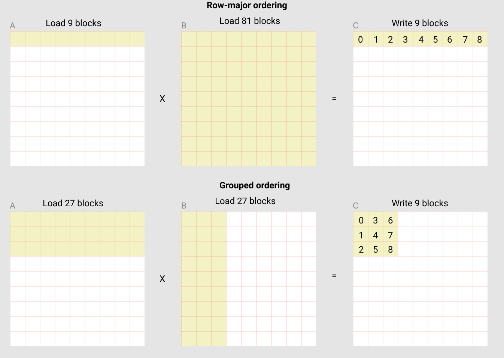

## Language specification
### Declarative Definitions
Declares the computation of elements with declarative purely functional semantics via `compute`, `reduce` and `scan`, as well as primitive element-wise functions, functional `for` (affine), functional `if`, and functional `while` for control flow.

matmul
```
A = Tensor<M, K; dtype>
B = Tensor<K, N; dtype>
y = compute (shape = [M, N]) |i, j| {
	reduce (shape = [K], op = sum) |k| {
		A[i, k] * B[k, j]
	}
}
```

softmax
```
A = Tensor<B, D; dtype>
t1 = compute (shape = [B, D]) |bi, di| {
	m = reduce (shape = [D], op = max) |di| A[bi, di] // inner scope di
	e = exp(A[bi, di] - m)
	e
}

y = compute (shape = [B, D]) |bi, di| {
	s = reduce (shape = [D], op = sum) |di| t1[bi, di]
	t1[bi, di] / s
}
```

Technically, `reduce` and `scan` can be achieved via `compute`.

```
y = reduce(shape = [N], op = sum) |i| A[i]
```
=>
```
yt = compute(shape = [2]) |i| {
	reduce(shape = [N/2], op = sum) |j| A[i * N / 2 + j]
}
y = yt[0] + yt[1]
```

similarly
```
y = scan(shape = [N], op = sum) |i| A[i]
```
=>
```
yt = compute(shape = 2) |i| {
	scan(shape = [N/2], op = sum) |j| A[i * N / 2 + j]
}
# yt.shape = [2, N / 2]
y = compute (shape = [N]) |i| {
	if i < N / 2 {
		yt[0, i]
	} else {
		yt[0, i - (N / 2)] + yt[1, i]
	}
}
```

These admits recursive definitions. However, we move `reduce` and `scan` to core ops, due to their commonality.

### Task Reduction
Theoretically everything can be described in the language of declarative definitions, but optimizers are not powerful enough for more complex access patterns, such as matmul. Therefore, to further constrain the search space, one can declaratively describe the decomposition of computation in a semantics similar to triton, but with more generality. Eg: triton only allows a decomposition at the thread-block level, while something like coorporative groups allows finer decomposition.

With this language, I envision arbitrary decomposition, eg, there is no kernel level boundary as is done in triton, but on a program level, with potentially multiple devices.

So something like jax's fmap could be done rather easily.

```
model: Tensor<seq_len, 768> -> Tensor<seq_len, 768>

data: Tensor<B, seq_len, 768>
y: Tensor<B, seq_len, 768> = compute (shape=[B]) |bi| {
	model(data[bi, :, :])
}
```

#### Matmul Example 
I think the core idea is the ability to progressive specify the decomposition to smaller computational blocks, eventually arriving at constant tile sizes mapped to threads.

This is a possible definition of matmul:
```
A = Tensor<M, K; dtype>
B = Tensor<K, N; dtype>
y = compute (shape = [M, N]) |i, j| {
	reduce (shape = [K], op = sum) |k| {
		A[i, k] * B[k, j]
	}
}
```
However, it is underspecified, so the search space is quite large.

Here is another more specific decomposition:
```
y = compute (shape = [M, N]) |i, j| {
	a_temp = read (shape = [K]) |ri| A[ri]
	b_temp = read (shape = [K]) |ri| B[ri]
	reduce (shape = [K], op = sum) |k| {
		a_temp[k] * b_temp[k]
	}
}
```
This suggests the program:
```c++
template<int M, int N, int K>
__global__ void matmul(float *a, float *b, float *c) {
	__shared__ float a_temp[K];
	__shared__ float b_temp[K];
	__shared__ float reduce[32];
	// blockIdx.x represents the row of a, while blockIdx.y represents
	// the col of b
	a_temp[threadIdx.x] = a[blockIdx.x * K + threadIdx.x];
	b_temp[threadIdx.x] = b[blockIdx.y + threadIdx.x * K];
	__syncthreads();
	c = a_temp[threadIdx.x] * b_temp[threadIdx.x];
	c = warp_reduce(c);
	if (threadIdx.x % 32 == 0) {
		reduce[threadIdx.x % 32] = c;
	}
	__syncthreads();
	if (threadIdx.x < 32) {
		c = warp_reduce(reduce[threadIdx.x]);
		if (threadIdx.x == 0) {
			c[blockIdx.x * M + blockIdx.y] = c
		}
	}
}
```
This program has many implicit assumptions, for example, K = 1024 and number of threads = 1024. But regardless, captures the above decomposition.

Another decomposition could be:

```
A = Tensor<N, K; dtype>
B = Tensor<K, M; dtype>

tile_n = tune(N) // dependent compile time constants
tile_k = tune(K)
tile_m = tune(M)

n_tiles = cdiv(N, tile_n)
m_tiles = cdiv(M, tile_m)
k_repeats = cdiv(K, tile_k)

y = grid (dim = [n_tiles, m_tiles]) |ni, mi| {
	offset_n = ni * tile_n
	offset_m = mi * tile_m
	init: Tensor<tile_n, tile_m; dtype> = zeros([tile_n, tile_m])

	res = affine_for (end = k_repeats, init = init) |ki, res| {
		offset_k = ki * tile_k
		block_a = compute (shape = [tile_n, tile_k]) |ni, ki| {
			if ni + offset_n < N and ki + offset_k < K
			then A[ni + offset_n, ki + offset_k]
			else 0
		}

		block_b: Tensor<tile_k, tile_m> = ...
		res_c = compute (shape = [tile_n, tile_m]) |ni, mi| {
			reduce (shape = [tile_k]) |ki| {
				block_a[ni, ki] * block_m[ki, mi]
			}
		}
		res + res_c
	}
	
}

```

Which captures grouped ordering

*Taken from  [triton-docs](https://triton-lang.org/main/getting-started/tutorials/03-matrix-multiplication.html#sphx-glr-getting-started-tutorials-03-matrix-multiplication-py)* 

#### Design Considerations
`compute` definitions do not mutate state at all, and admits a purely functional form. This is to avoid messy mutable tensors, mutable and immutable views, etc.

- Since currently everything is early stage, this condition could be relaxed in the future, to allow some mutability. I am concerned about potential pathological cases.

- There are three possible levels of mutability
1. Nothing is mutable, we use functional patterns to express the same ideas. Eg `let a = 1`, semantically creates a new variable `a`, and should `a` already exist, we shadow it. This can be limiting, especially since we can't use any intrisinic atomic operations. However, some advantages include the elimination of race conditions, as well as easier reasoning about high dimensional programs.
2. Special `thread` scope denoting threadblock semantics, which would allow instances to mutate a shared buffer, one scope above. With this, we have to extend the type system to allow mutable buffers, views and immutable views. 
	Forces to operate with cuda thread block semantics, cannot mutate outer scope, can only mutate items passed to `shared`, which have pointer semantics inside the scope.
	One cannot further nest `compute` and `reduce` within thread, as that would violate their contracts. (since they assume data residing on the outer scope is immutable)
```
x1: Tensor<M, K; f32>
y1 = empty (shape = [M, K], 
			dtype = f32, 
			layout = rowmajor,
			type = smem)

thread (blockDim: int, shared = [y1]) |thread_id: int| {
	x1[1] = 3 // not allowed, cannot mutate outer scope
	s1 = Shared<3, 3; f32> // shared with all threads of current scope
	s1[1] = 3 // allowed
	r1 = Register<1, 2; f32>
	sync()
	shared.0[thread_id] = 1
}

// the above thread definition implicitly redeclares y1, so that we don't get 
// into ownership / mutabilty semantics
```

3. Arbitrary mutation of upper scopes. I don't think this should be allowed, as doing so would introduce extra complexity to `compute`; there would need to be a synchronize operation, which would significantly impact the arbitrary nesting `compute`s, since threadblocks can't be synced.


## Starting Small
The above proposal is very vague and quite ambitious, if the goal is to match triton in performance. 

We can start small with a cut-down version, similar to triton such that the reduction happens explicitly at the block level. 

This aims to address 3 problems
1. Kernel fusion.
	This reveals the tension between imperative knowledge and declarative knowledge. Something abstract such as `tl.load` loads a block of memory from global to shared in an almost declarative fashion, so that it is possible to do fusion in general. Whereas elementwise, thread level loading is quite difficult to fuse, with corner cases like `cp_async`, and vectorized loading. Ideally, with more declarative front-ends, we can achieve greater fusion opportunities.
2. Reasoning about higher dimensional tensor programs.
	Thread-level CUDA programs are difficult to reason about, and can lead to brittle and un-maintainable code. Block/tile level operations makes reasoning much easier.
3. Expressing uncertainty between multiple potential implementations.
	It is very common for kernel programmers to come up with multiple competing implementations of the same operation, with minor changes such as access patterns or memory layouts. Often this results in massive code duplication, so the programmer heuristically picks an implementation without empirical evidence. (setting up all the benchmarks is a pain). We would like to elegantly express and decompose a declarative definition to its many possible imperative definitions, such that we express belief that a near optimal solution exists in the ones that we presented, and so that we do not rely on our internal ad-hoc heuristics, but either on concrete brute search, or heuristic searches that quantify the uncertainty precisely.

Additionally, I want to address a particular deficiency of triton that is particularly limiting: the inability to index into shared memory, or tiles.

```python
@triton.jit
def add_kernel(
    x_ptr,  # *Pointer* to first input vector.
    y_ptr,  # *Pointer* to second input vector.
    output_ptr,  # *Pointer* to output vector.
    n_elements,  # Size of the vector.
    BLOCK_SIZE: tl.constexpr,  # Number of elements each program should process.
                 # NOTE: `constexpr` so it can be used as a shape value.
):
    # There are multiple 'programs' processing different data. We identify which program
    # we are here:
    pid = tl.program_id(axis=0)  # We use a 1D launch grid so axis is 0.
    # This program will process inputs that are offset from the initial data.
    # For instance, if you had a vector of length 256 and block_size of 64, the programs
    # would each access the elements [0:64, 64:128, 128:192, 192:256].
    # Note that offsets is a list of pointers:
    block_start = pid * BLOCK_SIZE
    offsets = block_start + tl.arange(0, BLOCK_SIZE)
    # Create a mask to guard memory operations against out-of-bounds accesses.
    mask = offsets < n_elements
    # Load x and y from DRAM, masking out any extra elements in case the input is not a
    # multiple of the block size.
    x = tl.load(x_ptr + offsets, mask=mask)
    y = tl.load(y_ptr + offsets, mask=mask)
    output = x + y
    # x, y and output has shape [BLOCK_SIZE], and is logically in shared memory
    # but one cannot index into them

	output[0] += 1 # THIS CAUSES AN ERROR
	
    # Write x + y back to DRAM.
    tl.store(output_ptr + offsets, output, mask=mask)

```
*taken from [triton-tutorials-01](https://github.com/openai/triton/blob/main/python/tutorials/01-vector-add.py)*

This makes many algorithms like FFT impossible. 
*(technically its possible, but the performance would be worse than cpu)*


To this effect, we have the kernel scoping:

```python
@hidet.jit
def my_kernel(x: Tensor[[N, D], f32, RowMajor], 
			  y: Tensor[[N, D], f32, RowMajor],
			  output: Tensor[[N, D], f32, RowMajor]):
	tid = hidet.program_id()

	BLOCK_SIZE = hidet.auto_tune(D) # autotune based on D
	x_smem = compute(
		shape=[BLOCK_SIZE],
		fcompute=lambda di: x[tid, di],
		mem_type_hint=hidet.mem_type.smem,
		layout_hint=hidet.layouts.row_major
	)

	y_mem = load(...) # perhaps some abbreviation?

	res = x_mem + y_mem
	store(...)

	with hidet.thread_scope(...) as id:
		# now with thread semantics
```


So under each instance of the program, identified by `program_id()`, we have single threaded semantics. Tensors are manipulated by intrinsics operating on the tile level, and intermediate tiles have unspecified layout and memory type.

Speaking of which, each tensor type is parameterised by
1. `dtype` The datatype
2. `shape`
3. `mem_type` The type of memory, we have `global`, `shared`, `local` (registers)
4. `layout` The layout maps the logical index to the physical index. For memory type of `global` and `shared`, since each memory location is visible to all threads, the layout maps indices to indices; logical index to physical offset. When the memory type is `local`, the layout maps logical indices to the thread index and offset.

Tensors have reference semantics.

One can achieve thread-level manipulations by the `compute` intrinsic, or using a `thread_scope`. The `compute` intrinsic is pure and declarative, while under the `thread_scope`, normal CUDA thread block semantics applies. Eg, one would need to sync after `RAW`, `WAW`, etc. One can assume that all the operations before a `thread_scope` has already completed, and one must ensure that all operations have completed after exiting `thread_scope`.

`thread_scope`s cannot be nested, as it is logically the same as a CUDA threadblock. I do not consider dynamic parallelism for now.

Some problems needs to be solved with this design
1. Reconciling automatically determined Layouts with user desired/required layouts, this is only relevant with `thread_scope`
2. Reconciling automatically determined blocksizes with user desired/required blocksizes.

The design also needs to include considerations from wish 3, eg: Expressing uncertainty between multiple potential implementations. I would like for the user to express a computation without `thread_scope`, first and if performance is insufficient, add another computationally equivalent imperative definition on top, leaving it to the compiler to determine which choice is optimal for a particular subset of inputs.

